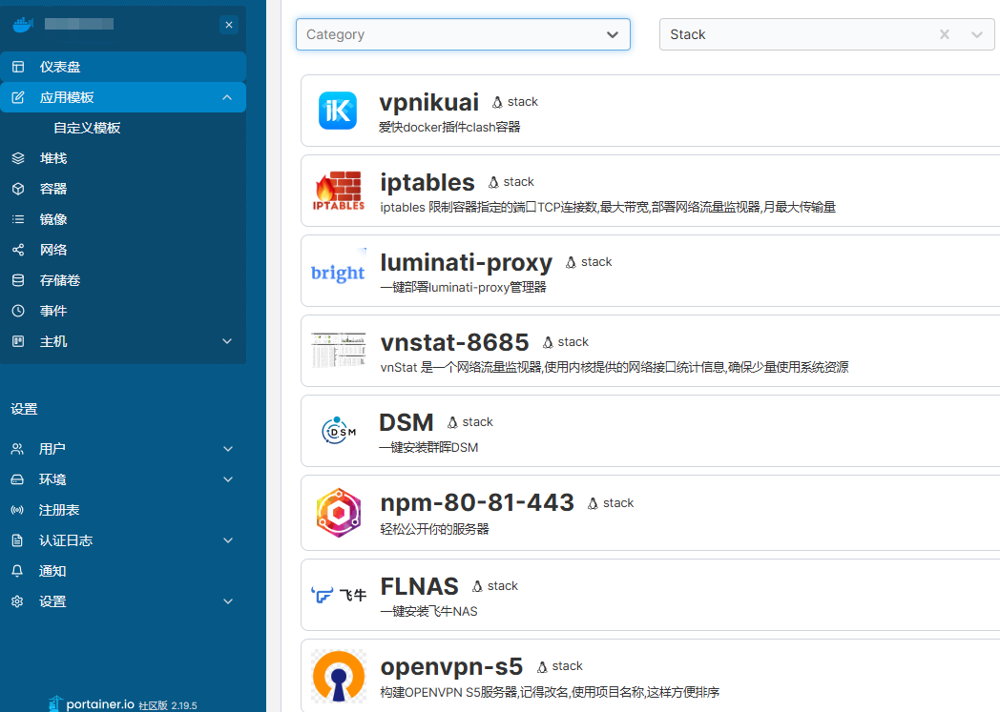

## 目的
个人收集整理的脚本，通过主菜单调用，方便快速部署

```
curl -sL https://bash.15099.net > my.sh && bash my.sh;rm -rf my.sh
```
## 局限
目前脚本只适配 Debian Ubuntu Armbian(ubuntu)

选择这三个发行版原因

1. Debian 我个人一直使用的稳定发行版，proxmox也是基于此发行版
2. Ubuntu 考虑大部分第一次接触linux，用的就是这个版本
3. Armbian 主要方便物理机部署，直接DD安装，推荐使用ubuntu发行版Server / CLI，支持qcow2和img下载
   
## 脚本内容

1. 更换系统（linux换其他版本、灌爱快系统、一键物理机安装armbian）
2. Linux初始化（升级、repo、时区、时间、主机名等）
3. Docker环境初始化（版本、代理、日志等设置）
4. Portainer中文图像界面安装
5. Bench压力测试

## 后续操作

通过脚本运行后，后续操作都是在[Portainer](https://hub.docker.com/r/lihaixin/portainer)界面上操作



